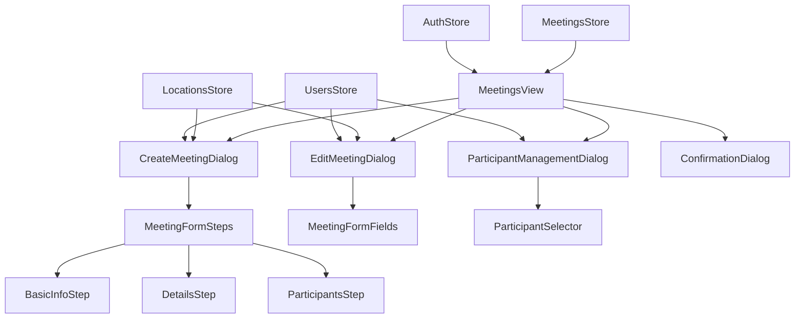

# Design Document

## Overview

The core meeting management system is built on Vue 3 with TypeScript, utilizing Pinia for state management and shadcn-vue components for the UI. The architecture follows a reactive pattern with centralized state management, proper error handling, and permission-based access control. The system integrates with a REST API backend that handles meeting CRUD operations, Zoom integration, and participant management.

## Architecture

### Component Architecture



### State Management Architecture

The system uses Pinia stores for centralized state management:

- **MeetingsStore**: Manages meeting data, CRUD operations, and API interactions
- **LocationsStore**: Handles meeting location data for offline/hybrid meetings
- **UsersStore**: Manages user data for participant selection
- **AuthStore**: Provides user permissions and authentication state

### API Integration Layer

All API interactions are handled through Axios with proper error handling, loading states, and response transformation. The system implements:

- Automatic token refresh and 401 handling
- Request/response interceptors for consistent error handling
- Loading state management for better UX
- Proper error message extraction and display

## Components and Interfaces

### Core Components

#### MeetingsView.vue (Enhanced)

- **Purpose**: Main meetings management interface
- **Features**:
  - Paginated meetings table with sorting and filtering
  - Permission-based action visibility
  - Loading states and error handling
  - Responsive design for mobile/desktop
- **Props**: None
- **Emits**: None
- **Key Methods**:
  - `fetchMeetings()`: Load meetings with pagination
  - `handleCreateMeeting()`: Open creation dialog
  - `handleEditMeeting(meeting)`: Open edit dialog
  - `handleDeleteMeeting(meeting)`: Show confirmation and delete

#### CreateMeetingDialog.vue (Enhanced)

- **Purpose**: Multi-step meeting creation interface
- **Features**:
  - Three-step wizard (Basic Info, Details, Participants)
  - Dynamic form validation based on meeting type
  - Location selection for offline/hybrid meetings
  - Participant selection with search functionality
  - Form persistence across steps
- **Props**: `open: boolean`
- **Emits**: `update:open`
- **Key Methods**:
  - `validateStep(step)`: Validate current step before proceeding
  - `handleSubmit()`: Create meeting with all collected data
  - `resetForm()`: Clear form data when dialog closes

#### EditMeetingDialog.vue (Enhanced)

- **Purpose**: Meeting editing interface
- **Features**:
  - Pre-populated form with existing meeting data
  - Dynamic field visibility based on meeting type
  - Location and participant management
  - Change tracking and confirmation
- **Props**: `open: boolean`, `meeting: Meeting | null`
- **Emits**: `update:open`
- **Key Methods**:
  - `loadMeetingData()`: Populate form with meeting data
  - `handleUpdate()`: Update meeting with changes
  - `trackChanges()`: Monitor form changes for UX

#### ParticipantManagementDialog.vue (New)

- **Purpose**: Dedicated participant management interface
- **Features**:
  - View current participants
  - Add new participants with search
  - Remove existing participants
  - Bulk participant operations
- **Props**: `open: boolean`, `meetingId: number`
- **Emits**: `update:open`
- **Key Methods**:
  - `fetchParticipants()`: Load current participants
  - `addParticipant(userId)`: Add new participant
  - `removeParticipant(userId)`: Remove participant

#### MeetingFormSteps.vue (New)

- **Purpose**: Reusable multi-step form component
- **Features**:
  - Step navigation and validation
  - Progress indication
  - Form state management
- **Props**: `currentStep: number`, `totalSteps: number`
- **Emits**: `step-change`, `form-submit`

### Enhanced Store Interfaces

#### MeetingsStore (Enhanced)

```typescript
interface MeetingsStore {
  // State
  meetings: Meeting[]
  currentMeeting: Meeting | null
  isLoading: boolean
  error: string | null
  pagination: PaginationState

  // Actions
  fetchMeetings(params?: MeetingQueryParams): Promise<void>
  fetchMeeting(id: number): Promise<Meeting>
  createMeeting(data: CreateMeetingPayload): Promise<Meeting>
  updateMeeting(id: number, data: UpdateMeetingPayload): Promise<Meeting>
  deleteMeeting(id: number): Promise<void>

  // Participant Management
  fetchParticipants(meetingId: number): Promise<User[]>
  addParticipant(meetingId: number, userId: number): Promise<void>
  removeParticipant(meetingId: number, userId: number): Promise<void>

  // Utility
  clearError(): void
  resetState(): void
}
```

### Form Validation Schema

Using Zod for type-safe form validation:

```typescript
const meetingSchema = z
  .object({
    topic: z.string().min(1, 'Topic is required').max(255, 'Topic too long'),
    description: z.string().optional(),
    start_time: z.string().datetime('Invalid date format'),
    duration: z.number().min(1, 'Duration must be at least 1 minute'),
    type: z.enum(['online', 'offline', 'hybrid']),
    location_id: z.number().optional(),
    password: z.string().max(10, 'Password too long').optional(),
    participants: z.array(z.number()).optional(),
  })
  .refine(
    (data) => {
      // Location required for offline/hybrid meetings
      if ((data.type === 'offline' || data.type === 'hybrid') && !data.location_id) {
        return false
      }
      return true
    },
    {
      message: 'Location is required for offline and hybrid meetings',
      path: ['location_id'],
    },
  )
```

## Data Models

### Enhanced Meeting Interface

```typescript
interface Meeting {
  id: number
  organizer: User
  topic: string
  description: string | null
  start_time: string
  duration: number
  type: 'online' | 'offline' | 'hybrid'
  host_key: string | null
  location: MeetingLocation | null
  zoom_meeting: ZoomMeeting | null
  participants?: User[]
  created_at: string
  updated_at: string
}

interface CreateMeetingPayload {
  topic: string
  description?: string
  start_time: string
  duration: number
  type: 'online' | 'offline' | 'hybrid'
  location_id?: number
  password?: string
  participants?: number[]
  settings?: Record<string, any>
}

interface UpdateMeetingPayload {
  topic?: string
  description?: string
  start_time?: string
  duration?: number
  location_id?: number
  settings?: Record<string, any>
}
```

### Pagination and Query Interfaces

```typescript
interface PaginationState {
  currentPage: number
  totalPages: number
  totalItems: number
  itemsPerPage: number
}

interface MeetingQueryParams {
  page?: number
  start_date?: string
  end_date?: string
  type?: string
  search?: string
}
```

## Error Handling

### Error Types and Handling Strategy

1. **Validation Errors (422)**

   - Display field-specific error messages
   - Highlight problematic form fields
   - Prevent form submission until resolved

2. **Permission Errors (403)**

   - Show access denied messages
   - Hide unauthorized actions
   - Redirect to appropriate pages if needed

3. **Not Found Errors (404)**

   - Display resource not found messages
   - Provide navigation back to main view
   - Handle stale data scenarios

4. **Network Errors**

   - Show retry buttons
   - Implement exponential backoff
   - Provide offline indicators

5. **Server Errors (500)**
   - Display generic error messages
   - Log errors for debugging
   - Provide support contact information

### Error Display Components

```typescript
interface ErrorState {
  type: 'validation' | 'permission' | 'network' | 'server'
  message: string
  field?: string
  retryable: boolean
}
```

## Testing Strategy

### Unit Testing

- **Component Testing**: Test individual components with Vue Test Utils
- **Store Testing**: Test Pinia stores with mock API responses
- **Utility Testing**: Test helper functions and validators
- **Form Validation**: Test Zod schemas with various inputs

### Integration Testing

- **API Integration**: Test API calls with mock server responses
- **Component Integration**: Test component interactions and data flow
- **Permission Testing**: Test permission-based UI behavior
- **Error Handling**: Test error scenarios and recovery

### E2E Testing Considerations

- **Meeting Lifecycle**: Test complete meeting creation, editing, and deletion flows
- **Permission Scenarios**: Test different user roles and permissions
- **Form Validation**: Test form validation across different meeting types
- **Error Recovery**: Test error handling and user recovery paths

### Test Data Management

- **Mock Data**: Consistent test data for meetings, users, and locations
- **API Mocking**: Mock API responses for different scenarios
- **State Management**: Test state changes and persistence
- **Permission Mocking**: Mock different user permission levels

## Performance Considerations

### Optimization Strategies

1. **Lazy Loading**: Load meeting details on demand
2. **Pagination**: Implement server-side pagination for large datasets
3. **Caching**: Cache frequently accessed data (locations, users)
4. **Debouncing**: Debounce search inputs and API calls
5. **Virtual Scrolling**: For large participant lists

### Bundle Optimization

- **Code Splitting**: Split meeting management into separate chunks
- **Tree Shaking**: Remove unused UI components
- **Component Lazy Loading**: Load dialogs only when needed

## Security Considerations

### Permission Enforcement

- **Client-Side**: Hide unauthorized UI elements
- **Server-Side**: Rely on API permission validation
- **Token Management**: Handle token refresh and expiration

### Data Validation

- **Input Sanitization**: Validate all user inputs
- **XSS Prevention**: Escape user-generated content
- **CSRF Protection**: Include CSRF tokens in API requests

### Sensitive Data Handling

- **Meeting Passwords**: Handle securely, don't log
- **Zoom Integration**: Secure API key management
- **User Data**: Minimize exposure of sensitive user information
