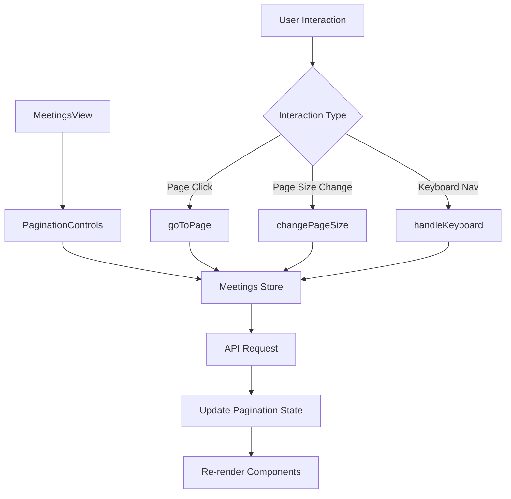

# Design Document

## Overview

This design addresses the pagination enhancement for the MeetingsView.vue component. The current implementation has several issues: it manually creates page number buttons instead of using the proper pagination components, lacks proper ellipsis handling, doesn't support page size selection, and has no keyboard navigation. This design will fix these issues and provide a more robust, accessible, and user-friendly pagination experience.

## Architecture

### Component Structure

The pagination enhancement will involve:

1. **Enhanced MeetingsView.vue**: Updated to use proper pagination components and support new features
2. **PaginationControls.vue**: A new reusable component that encapsulates pagination logic
3. **Store Enhancements**: Updates to the meetings store to support page size changes
4. **Keyboard Navigation**: Event handlers for arrow key navigation
5. **Responsive Design**: Mobile-first approach with progressive enhancement

### Data Flow



## Components and Interfaces

### PaginationControls Component

A new reusable component that will handle all pagination logic:

```typescript
interface PaginationControlsProps {
  currentPage: number
  totalPages: number
  totalItems: number
  itemsPerPage: number
  hasNextPage: boolean
  hasPrevPage: boolean
  isLoading?: boolean
  onPageChange: (page: number) => void
  // Note: Page size is server-controlled, no client-side page size selection
}
```

### Store Interface Updates

Enhanced MeetingQueryParams based on actual API parameters:

```typescript
export interface MeetingQueryParams {
  page?: number // API parameter for pagination
  topic?: string // API parameter for topic search
  start_time?: string // API parameter for date filtering (format: YYYY-MM-DD)
  location?: string // API parameter for location filtering
  type?: string // API parameter for type filtering (online, offline, hybrid)
  // Calendar endpoint specific parameters
  start_date?: string // For calendar endpoint only
  end_date?: string // For calendar endpoint only
}

export interface PaginationState {
  currentPage: number
  totalPages: number
  totalItems: number
  itemsPerPage: number
  hasNextPage: boolean
  hasPrevPage: boolean
  // Note: API doesn't support per_page parameter, so page size is server-controlled
}
```

### Pagination Logic

The pagination will use a smart algorithm to show page numbers:

- Always show first and last page
- Show current page and 2 pages on each side
- Use ellipsis when there are gaps
- Responsive behavior: fewer pages on mobile

```typescript
interface PageRange {
  pages: (number | 'ellipsis')[]
  showFirst: boolean
  showLast: boolean
}

function calculatePageRange(
  currentPage: number,
  totalPages: number,
  maxVisible: number = 7,
): PageRange
```

## Data Models

### Enhanced Pagination State

```typescript
interface EnhancedPaginationState extends PaginationState {
  maxVisiblePages: number
  // Note: Page size is controlled by the server, not configurable by client
}
```

### API Response Structure

Based on the meetings store, the API returns pagination metadata:

```typescript
interface MeetingsResponse {
  data: Meeting[]
  meta: {
    current_page: number
    last_page: number
    total: number
    per_page: number
    from: number
    to: number
  }
}
```

## Error Handling

### Pagination Error States

1. **Invalid Page Number**: Redirect to page 1 if page number is out of range
2. **Network Errors**: Show retry button in pagination area
3. **Loading States**: Disable pagination controls during data fetching
4. **Empty Results**: Hide pagination when no results are found

### Error Recovery

```typescript
interface PaginationErrorHandler {
  onInvalidPage: (page: number, maxPage: number) => void
  onNetworkError: (error: Error) => void
  onLoadingStateChange: (isLoading: boolean) => void
}
```

## Testing Strategy

### Unit Tests

1. **PaginationControls Component**:

   - Page number generation logic
   - Ellipsis placement
   - Keyboard navigation
   - Page size changes
   - Loading states

2. **Store Methods**:
   - Page size persistence
   - Query parameter building
   - Pagination state updates

### Integration Tests

1. **MeetingsView Integration**:
   - Filter + pagination interaction
   - Search + pagination reset
   - Page size + filter preservation

### E2E Tests

1. **User Workflows**:
   - Navigate through multiple pages
   - Change page size and verify results
   - Use keyboard navigation
   - Mobile responsive behavior

## Implementation Details

### Keyboard Navigation

```typescript
interface KeyboardHandler {
  onArrowLeft: () => void
  onArrowRight: () => void
  onHome: () => void
  onEnd: () => void
  onPageUp: () => void
  onPageDown: () => void
}
```

### Responsive Breakpoints

- **Mobile (< 640px)**: Show only prev/next with page info
- **Tablet (640px - 1024px)**: Show 5 page numbers max
- **Desktop (> 1024px)**: Show full pagination with 7 page numbers

### Accessibility Features

1. **ARIA Labels**: Proper labeling for screen readers
2. **Focus Management**: Clear focus indicators and logical tab order
3. **Keyboard Support**: Full keyboard navigation
4. **Screen Reader Support**: Announce page changes and loading states

### Performance Optimizations

1. **Debounced Page Size Changes**: Prevent rapid API calls
2. **Memoized Page Calculations**: Cache page range calculations
3. **Lazy Loading**: Only load visible page data
4. **Request Cancellation**: Cancel previous requests when navigating quickly

### Local Storage Integration

Store user preferences for pagination:

```typescript
interface PaginationPreferences {
  lastUsedFilters?: MeetingQueryParams
  // Note: Page size is server-controlled, so not stored in preferences
}
```

## Mobile Considerations

### Touch Interactions

- Larger touch targets (minimum 44px)
- Swipe gestures for page navigation
- Pull-to-refresh for data reload

### Simplified UI

- Condensed pagination on small screens
- Page size selector in dropdown menu
- Collapsible filter section

## Browser Compatibility

- Modern browsers with ES2020 support
- Graceful degradation for older browsers
- Progressive enhancement approach
